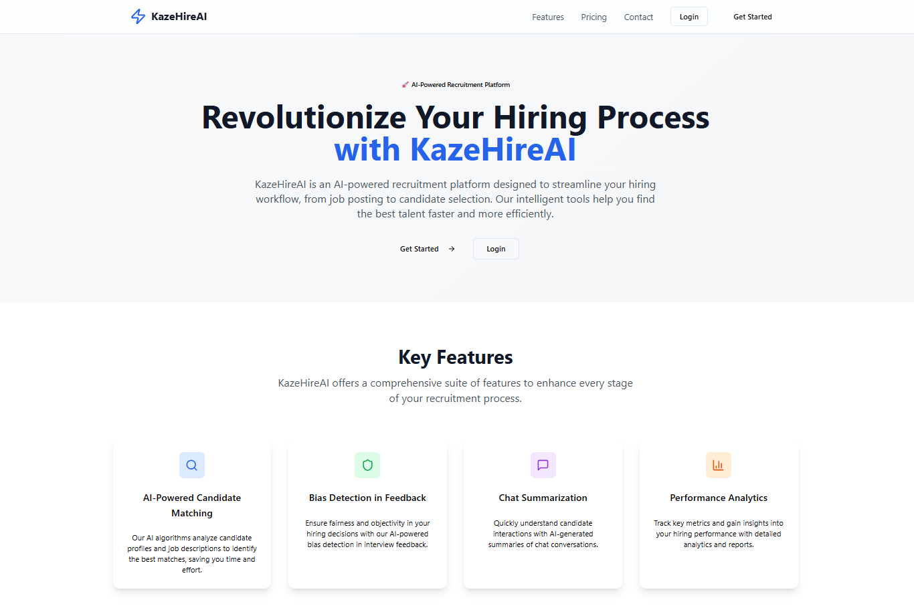

# 🚀 KazeHire AI

> An AI-powered recruitment platform that streamlines the hiring process with intelligent candidate matching, bias detection, and automated interview summaries.


## 📋 Overview

KazeHire AI revolutionizes recruitment by combining traditional hiring workflows with cutting-edge AI technology. Built for HR professionals and interviewers, it offers intelligent resume matching, automated candidate summarization, and bias detection to make hiring more efficient and fair.




## ✨ Core Features

### 👥 For HR Professionals
- **📝 Job Management** - Create, edit, and track job postings
- **👤 Candidate Pool** - Comprehensive candidate management with resume storage
- **🤖 AI Resume Matcher** - Match top 5 candidates from existing pool or manual uploads
- **💬 Chat Summarizer** - Extract availability, salary expectations, and insights from transcripts
- **📅 Interview Scheduling** - Assign interviews to interviewers with ease
- **🔍 Bias Detection** - Identify potential bias in interview feedback

### 🎤 For Interviewers
- **📋 Assigned Interviews** - View and manage assigned interview schedule
- **📝 Feedback Submission** - Submit detailed interview feedback
- **🤖 AI Summary Generation** - Generate intelligent summaries with fit scores
- **👀 Interview History** - Track completed interviews and outcomes

## 🛠️ Tech Stack

### Frontend
- **Next.js 14** - React framework with Pages Router
- **TypeScript** - Type-safe development
- **Tailwind CSS** - Utility-first CSS framework
- **shadcn/ui** - Beautiful component library
- **React Hook Form** - Performant form handling
- **TanStack Query** - Data fetching and caching
- **Framer Motion** - Smooth animations

### Backend & Infrastructure
- **Next.js API Routes** - Serverless backend
- **Supabase** - Database, Auth, and Storage
- **Google Gemini AI** - AI-powered features
- **Vercel** - Deployment platform

## 🚀 Quick Start

### Prerequisites
- Node.js 18+ and npm
- Supabase account
- Google AI (Gemini) API key

### Installation

1. **Clone the repository**
   ```bash
   git clone https://github.com/haarry9/kazehireai-project.git
   cd kazehireai-project
   ```

2. **Install dependencies**
   ```bash
   npm install
   ```

3. **Set up environment variables**
   ```bash
   cp .env.example .env.local
   ```
   
   Update `.env.local` with your credentials:
   ```env
   NEXT_PUBLIC_SUPABASE_URL=your-supabase-url
   NEXT_PUBLIC_SUPABASE_ANON_KEY=your-supabase-anon-key
   GEMINI_API_KEY=your-gemini-api-key
   ```

4. **Set up Supabase database**
   - Create tables: `users`, `jobs`, `candidates`, `interviews`
   - Set up Storage buckets for resumes and transcripts
   - Configure authentication

5. **Run the development server**
   ```bash
   npm run dev
   ```

   Open [http://localhost:3000](http://localhost:3000) to view the application.

## �� Usage

### Getting Started
1. **Sign Up** - Choose your role (HR or Interviewer)
2. **HR Users** - Access the full dashboard to manage jobs and candidates
3. **Interviewers** - View assigned interviews and submit feedback

### Core Workflows

#### 🏢 HR Workflow
1. Create job postings with detailed descriptions
2. Upload candidate resumes and profiles
3. Use AI Resume Matcher to find top candidates
4. Schedule interviews with assigned interviewers
5. Review feedback and run bias detection

#### 🎯 Interviewer Workflow
1. View assigned interviews and candidate profiles
2. Conduct interviews and submit detailed feedback
3. Generate AI-powered summaries with fit scores
4. Track interview history and outcomes

## 🏗️ Project Structure

```
kazehireai-project/
├── components/          # Reusable UI components
│   ├── candidates/     # Candidate-specific components
│   ├── interviews/     # Interview-related components
│   ├── jobs/          # Job management components
│   ├── shared/        # Shared components (Navbar, Sidebar)
│   └── ui/            # shadcn/ui components
├── pages/             # Next.js pages and API routes
│   ├── api/          # Backend API endpoints
│   ├── auth/         # Authentication pages
│   ├── candidates/   # Candidate management pages
│   ├── interviews/   # Interview pages
│   └── jobs/         # Job management pages
├── lib/              # Utility libraries
├── hooks/            # Custom React hooks
├── types/            # TypeScript type definitions
└── styles/           # Global styles
```

## 🔧 API Endpoints

### Jobs
- `GET /api/jobs` - List all jobs
- `POST /api/jobs` - Create new job
- `PATCH /api/jobs/[id]` - Update job status

### Candidates
- `GET /api/candidates` - List candidates
- `POST /api/candidates` - Add new candidate
- `POST /api/candidates/[id]/summarize_chat` - AI chat analysis

### Interviews
- `GET /api/interviews/assigned` - Get assigned interviews
- `POST /api/interviews/schedule` - Schedule interview
- `POST /api/interviews/[id]/feedback` - Submit feedback

### AI Features
- `POST /api/resume_match/existing_pool` - Match from candidate pool
- `POST /api/resume_match/manual_upload` - Match uploaded resumes
- `POST /api/interviews/[id]/bias_check` - Detect bias in feedback

## 🤝 Contributing

We welcome contributions! Please see our [Contributing Guidelines](CONTRIBUTING.md) for details.

1. Fork the repository
2. Create your feature branch (`git checkout -b feature/amazing-feature`)
3. Commit your changes (`git commit -m 'Add amazing feature'`)
4. Push to the branch (`git push origin feature/amazing-feature`)
5. Open a Pull Request

## 📝 License

This project is licensed under the MIT License - see the [LICENSE](LICENSE) file for details.

## 🙏 Acknowledgments

- **Supabase** for providing excellent backend infrastructure
- **Google AI** for powering our intelligent features
- **shadcn/ui** for beautiful, accessible components
- **Vercel** for seamless deployment

## 📞 Support

Need help? Reach out to us:
- 📧 Email: support@kazehire.ai
- 💬 Discord: [Join our community](https://discord.gg/kazehire)
- 📚 Documentation: [docs.kazehire.ai](https://docs.kazehire.ai)

---

<p align="center">Made with ❤️ by the KazeHire team</p>
